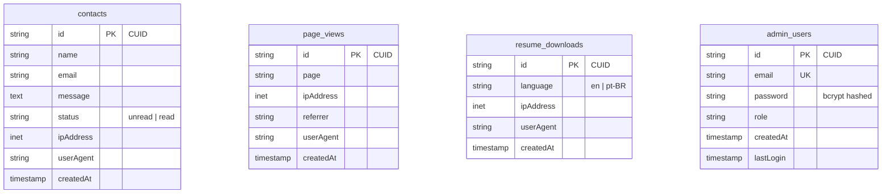

<div align="center">

# Mateus Ribeiro de Campos — Portfolio

**Backend Developer | Computer Science | Brazil**

[](https://portfolio-mateusribeirocampos.vercel.app/)
[](https://nextjs.org/)
[](https://nestjs.com/)
[](https://www.typescriptlang.org/)
[](https://supabase.com/)
[](https://prisma.io/)

*A production-ready full-stack portfolio with admin dashboard, real-time analytics, and bilingual i18n support.*

</div>

---

## Overview

This is not just a static portfolio — it's a **full-stack web application** demonstrating professional engineering practices end-to-end: from a performant Next.js frontend with internationalization to a secure NestJS REST API, a normalized PostgreSQL database, JWT-based admin authentication, and a real-time analytics dashboard.

**Live URL**: [portfolio-mateusribeirocampos.vercel.app](https://portfolio-mateusribeirocampos.vercel.app/)
**Backend API**: [portfolio-backend-ns0j.onrender.com](https://portfolio-backend-ns0j.onrender.com)
**GitHub**: [github.com/mateusribeirocampos](https://github.com/mateusribeirocampos)
**LinkedIn**: [linkedin.com/in/mateus-ribeiro-de-campos-6a135331](https://www.linkedin.com/in/mateus-ribeiro-de-campos-6a135331/)

---

## About Me

BSc in Computer Science with a PhD background in Entomology, currently focused on backend software engineering. I build applications using Java, Spring Boot, REST APIs, and SQL databases, with attention to clean architecture, testing, and maintainable code.

My research experience developed strong analytical thinking and problem-solving skills, which I now apply to designing reliable backend systems.

**Currently seeking Junior Backend Developer opportunities (remote or international).**

---

## Technical Stack

### Engineering Highlights

• JWT authentication and protected admin routes  
• Production security headers (CSP, HSTS, XSS protection)  
• Real-time analytics dashboard  
• Internationalization with middleware routing  
• PostgreSQL schema with indexed queries

### Frontend

| Category | Technology |
|---|---|
| Framework | Next.js 15.2 (App Router, SSR/SSG) |
| Language | TypeScript 5.8 |
| Styling | Tailwind CSS 3.3, shadcn/ui, Radix UI |
| Animations | Framer Motion, custom matrix rain, decoder text |
| Forms | React Hook Form + Zod validation |
| i18n | next-i18next, react-i18next (EN / PT-BR) |
| Theme | next-themes (dark/light mode) |
| Charts | Recharts |
| Tracking | Custom page-view analytics client |

### Backend

| Category | Technology |
|---|---|
| Framework | NestJS 11 (modular architecture) |
| Language | TypeScript 5.7 |
| ORM | Prisma 6.16 |
| Database | PostgreSQL (Supabase) |
| Auth | JWT + Passport + bcryptjs |
| Security | Helmet, CORS, throttling, rate limiting |
| Validation | class-validator, class-transformer |
| Testing | Jest 30 + Supertest |

### Infrastructure

| Category | Technology |
|---|---|
| Frontend Hosting | Vercel |
| Backend Hosting | Render |
| Database | Supabase (PostgreSQL) |
| CI / Keep-Alive | GitHub Actions |
| SEO | next-sitemap (auto sitemap + robots.txt) |
| Package Manager | npm |

---

## Architecture

```
portfolio/
├── frontend/                    # Next.js 15 Application
│   ├── app/
│   │   ├── page.tsx             # Home (with matrix rain, decoder animations)
│   │   ├── about/               # Professional background & skills
│   │   ├── blog/                # Technical blog (MDX-ready)
│   │   ├── contact/             # Contact form with backend integration
│   │   ├── projects/            # Featured project showcase
│   │   └── admin/               # Protected admin area
│   │       ├── login/           # JWT login page
│   │       └── dashboard/       # Analytics + contacts management
│   ├── components/
│   │   ├── ui/                  # 40+ shadcn/ui components
│   │   ├── decoderText/         # Custom text animation
│   │   ├── matrixRain.tsx       # Canvas matrix background
│   │   └── page-tracker.tsx     # Client-side page view tracking
│   ├── public/locales/
│   │   ├── en/                  # English translation files
│   │   └── pt-BR/               # Brazilian Portuguese translation files
│   ├── middleware.ts            # Language routing + admin auth guard
│   └── next.config.ts          # CSP headers, image config, security
│
├── backend/                     # NestJS REST API
│   ├── src/
│   │   ├── modules/
│   │   │   ├── admin/           # Dashboard, contacts, auth, JWT
│   │   │   ├── analytics/       # Page view tracking endpoint
│   │   │   ├── contact/         # Contact form + rate limiting
│   │   │   ├── resume/          # Download tracking + stats
│   │   │   └── health/          # Health check
│   │   ├── common/
│   │   │   ├── decorators/      # IP + User-Agent extraction
│   │   │   ├── filters/         # Global HTTP exception filter
│   │   │   └── guards/          # Rate limiting guard
│   │   └── main.ts              # Bootstrap: helmet, CORS, compression, pipes
│   └── prisma/
│       ├── schema.prisma        # DB schema with indexes
│       └── migrations/          # Versioned migration history
│
└── .github/workflows/
    └── port-ping.yml            # Scheduled keep-alive for Supabase free tier
```

---

## Key Features

### Internationalization (i18n)

- English (default) with clean URLs — no `/en` prefix
- Brazilian Portuguese with `/pt-BR` prefix
- Cookie-based locale persistence (1-year expiry)
- Middleware-driven language routing

### Admin Dashboard

- JWT authentication with bcryptjs password hashing
- Protected `/admin` routes (frontend middleware + backend guards)
- Contact submissions management (status updates, pagination, filtering)
- Real-time analytics: page views, resume downloads, top pages
- Time-series charts (daily aggregation via Recharts)

### Analytics & Tracking

- Lightweight client-side page-view tracking (`POST /api/ev/pv`)
- Admin routes excluded from tracking
- Fire-and-forget pattern for zero performance impact
- Dashboard stats: total views, last 30/7 days, top 5 pages

### Security

- Strict Content Security Policy (CSP) headers
- `X-Frame-Options: DENY` — clickjacking prevention
- `X-Content-Type-Options: nosniff`
- `Strict-Transport-Security` (1 year, includeSubDomains)
- XSS-safe DOM manipulation (no `innerHTML` or `dangerouslySetInnerHTML`)
- Input validation at all API boundaries (class-validator + Zod)
- Per-IP rate limiting on contact submissions (5/hour)
- Zero npm audit vulnerabilities

---

## Database Schema



**Indexes**: `createdAt` on all tables, composite `[page, createdAt]` on page_views, `status` on contacts.

---

## Getting Started

### Prerequisites

- Node.js 18+
- PostgreSQL database (or Supabase account)

### Frontend

```bash
cd frontend
npm install
npm run dev        # http://localhost:3000
```

### Backend

```bash
cd backend
npm install
cp .env.example .env      # Add DATABASE_URL, JWT_SECRET, CORS_ORIGINS
npx prisma migrate dev    # Apply migrations
npm run start:dev         # http://localhost:3001
```

### Admin Setup

```bash
cd backend
npm run create-admin      # Interactive script to create first admin user
```

### Production Build

```bash
# Frontend
cd frontend && npm run build && npm start

# Backend
cd backend && npm run build && npm run start:prod
```

---

## API Reference

| Method | Endpoint | Description | Auth |
|---|---|---|---|
| `POST` | `/contact` | Submit contact form | Public |
| `GET` | `/contact` | List contacts (paginated) | Admin |
| `PATCH` | `/contact/:id/status` | Update contact status | Admin |
| `POST` | `/api/ev/pv` | Record page view | Public |
| `GET` | `/admin/dashboard` | Dashboard statistics | Admin |
| `GET` | `/admin/analytics` | Time-series analytics | Admin |
| `GET` | `/admin/profile` | Authenticated user info | Admin |
| `POST` | `/admin/login` | JWT login | Public |
| `GET` | `/resume/download/:lang` | Download resume (tracked) | Public |
| `GET` | `/resume/stats` | Download statistics | Admin |
| `GET` | `/health` | API health check | Public |

---

## Featured Projects

### [Dragenda](https://dragenda.vercel.app) — Digital Healthcare Platform

React Native mobile app + React.js web dashboard for healthcare delivery.
`React Native` `React.js` `Node.js` `Express` `SQLite` `Bootstrap`

### [Santa Rita Church Website](https://igrejasantaritaourofino.vercel.app/)

Production church website with responsive design and modern UI.
`React.js` `TypeScript` `Tailwind CSS` `Vite`

### [DIO — Image Recommendation System](https://github.com/mateusribeirocampos/diollm)

ML-based image similarity and recommendation system.
`Python` `Jupyter Notebook` `Machine Learning` `Deep Learning`

---

## Available Scripts

### Frontend

| Command | Description |
|---|---|
| `npm run dev` | Start development server |
| `npm run build` | Production build + sitemap |
| `npm start` | Start production server |
| `npm run lint` | Run ESLint |

### Backend

| Command | Description |
|---|---|
| `npm run start:dev` | Development server (watch mode) |
| `npm run build` | Compile TypeScript |
| `npm run start:prod` | Start compiled production server |
| `npm test` | Run Jest unit tests |
| `npm run create-admin` | Create admin user |

---

## License

[MIT](LICENSE) — Open source, freely usable.

---

<div align="center">

**Open to junior positions in software development.**
*Bridging analytical science with modern software engineering.*

[portfolio-mateusribeirocampos.vercel.app](https://portfolio-mateusribeirocampos.vercel.app/) · [GitHub](https://github.com/mateusribeirocampos) · [LinkedIn](https://www.linkedin.com/in/mateus-ribeiro-de-campos-6a135331/)

*Last updated: February 2026*

</div>
